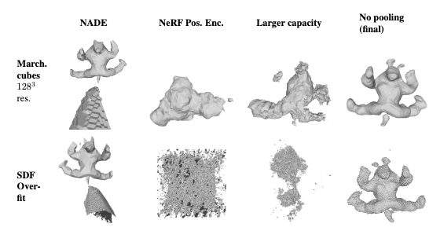

# Robust Neural Fields - BACON as Framework for NN Distance Extractor

The idea is to use Neural Networks as alternative to the classical (normal aware) distance field extraction methods,
that have troubles when e.g. normals are not well defined.
  
If interested in the topic, you can find more details in the MeshCNN fork
we adopted as a regression NN distance extractor for our SDF Overfitting
which can be found
here: [MeshCNN Fork](https://github.com/julianstrietzel/MeshCNN)

The project is part of the lecture "[Advanced Deep Learning for Computer Vision](https://niessner.github.io/ADL4CV/)" at
the Technical University of Munich.

We are using Bacon as a framework to implement different distance extractors:

Look into the Subfolder [Readme](df_prediction_networks/SubReadMe.md) for more information on how to use other
distance extractors and use Bacon to use them for SDF Overfitting. Make sure that the sub repositories you want to use
are working with the same environment as this repository.  
When using this Repository please refer to the original documentation for set up. But use the env_export.yml to set up
the environment, which is a modified version to work with our project and also the related MeshCNN Fork.

